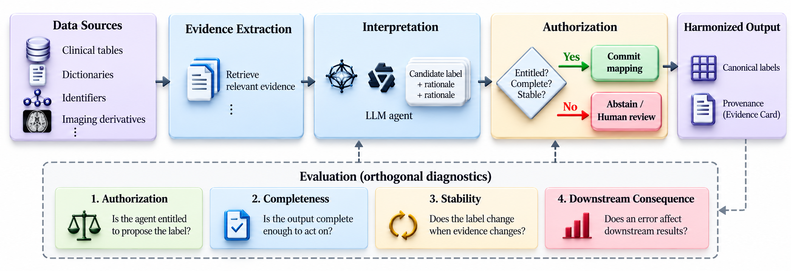

# Label Agreement Does Not Measure Authorization

<p align="center">
  
  &nbsp;&nbsp;&nbsp;
  
  &nbsp;&nbsp;&nbsp;
  
</p>

<p align="center">
  <a href="https://neurips.cc/"></a>
  <a href="https://aim-neurips26.github.io/"></a>
  
  
</p>

Official research code accompanying the paper:

> **Label Agreement Does Not Measure Authorization**<br>
> Accepted to the [AIM Workshop](https://aim-neurips26.github.io/) at [NeurIPS 2026](https://neurips.cc/)

This repository implements and audits a bounded LLM pipeline for harmonizing neuroimaging metadata across COBRE and FBIRN. The central result is that semantic label agreement alone does not establish that an agent was authorized by the available evidence, followed its output contract, or responded correctly when decisive evidence changed.

## Overview

The workflow separates interpretation from commitment:

<p align="center">
  
</p>

<p align="center"><em>Read-only source evidence is converted into an LLM candidate, then checked by a deterministic authorization gate. Orthogonal diagnostics evaluate authorization, completeness, stability under evidence changes, and downstream consequences.</em></p>

Source readers extract structure, aggregate value signatures, dictionary entries, identifier overlap, lineage, and imaging row-order checks without exposing raw subject rows to the model. The LLM proposes a controlled action, while a deterministic controller validates evidence requirements and blocks unsupported commitments.

## Evaluation

The audit uses three complementary panels:

- **Real panel:** 230 file, column, value, identity, and governance decisions from 88 base units in 16 lineage families.
- **Synthetic panel:** 90 paired cases with controlled evidence changes, including 58 pairs used for the controlled-error consistency test.
- **Downstream analysis:** diagnosis prediction from Neuromark sFNC features for 157 COBRE and 311 FBIRN rows.

The evaluation keeps six outcomes separate: label agreement, action agreement, case success, unsafe commitment rate, coverage, and exact repair. It also measures contract completeness, controlled-error consistency (CEC), and downstream sensitivity to metadata errors.

## Key Findings

- Revealing the upstream proposal barely changes Gemma4 label agreement (**0.857 to 0.870**) while action agreement rises from **0.409 to 0.830**.
- Every contract-arm response parses as JSON, yet the required authorization field is missing in **23/230 Gemma4** and **77/230 Qwen3** outputs.
- A frozen-answer adversary is perfect on original cases but scores **0.000 CEC** after decisive evidence changes; the deterministic gate scores **0.948** overall and **1.000** on mechanistic pairs.
- Shuffling half of the metadata-to-image row order reduces downstream AUC by **0.13 on COBRE** and **0.26 on FBIRN**, despite leaving label and schema metrics unchanged.

### Interface ablation

| System | Label agreement | Action agreement | Case success | Unsafe rate | Commitment |
| --- | ---: | ---: | ---: | ---: | ---: |
| Gemma4 hidden | 0.857 | 0.409 | 0.387 | 0.378 | 0.726 |
| Gemma4 visible | 0.870 | 0.830 | 0.765 | 0.191 | 0.917 |
| Gemma4 contract | 0.843 | 0.726 | 0.643 | 0.278 | 0.896 |
| Qwen3 hidden | 0.600 | 0.265 | 0.230 | 0.200 | 0.409 |
| Qwen3 visible | 0.726 | 0.374 | 0.296 | 0.352 | 0.617 |
| Qwen3 contract | 0.704 | 0.430 | 0.343 | 0.348 | 0.670 |
| Deterministic reference | 0.952 | 0.983 | 0.952 | 0.048 | 0.957 |

Reference labels are rule-derived, so these numbers measure consistency with the audit protocol rather than clinical correctness. The deterministic reference shares that derivation and is not an independent baseline.

## Repository

```text
src/evidence_harmonization/
  source_io.py, matlab.py, privacy.py    read-only readers and aggregate profiles
  cards.py                              Evidence Card construction
  benchmark.py, synthetic.py            real and controlled evaluation panels
  agent.py, llm.py                      bounded candidate generation
  environment.py, controller.py         read-only tools and authorization gates
  baselines.py, cec.py                   reference controls and changed-evidence tests
  evaluate.py, analysis.py, stats.py     metrics and statistical analysis
  downstream.py, bundle.py               sFNC sensitivity and cohort bundles
scripts/                                 pipeline and reproduction commands
configs/                                 sources, concept bases, and ontology
slurm/                                   multi-GPU interface ablation
tests/                                   unit and integration tests
```

Restricted cohort data, model outputs, source-derived Evidence Cards, and local run artifacts are not distributed.

## Installation

```bash
git clone https://github.com/amir-sbg/Label-Agreement-Does-Not-Measure-Authorization.git
cd Label-Agreement-Does-Not-Measure-Authorization

python -m venv .venv
source .venv/bin/activate
pip install -e ".[agent,dev]"
pytest
```

Python 3.11 or later is required. The test suite uses the included synthetic panel and does not require a GPU or restricted data.

## Quick Start

Run the public synthetic panel with Qwen3:

```bash
python scripts/run_agent.py \
  --cases data/synthetic_panel/cases.jsonl \
  --model Qwen/Qwen3-4B-Instruct-2507 \
  --interface visible \
  --output runs/demo/shards/shard_000.jsonl

python scripts/merge_evaluate.py \
  --shards runs/demo/shards \
  --oracle data/synthetic_panel/oracle.jsonl \
  --output runs/demo
```

## Reproducing the Paper

COBRE and FBIRN are access-restricted. With authorized access to the NeuroMark data tree:

```bash
export NEUROMARK_ROOT=/path/to/neuromark
export BUNDLE_SALT=<private-pseudonymization-salt>

scripts/reproduce.sh build
scripts/reproduce.sh controls

sbatch --partition=<partition> --account=<account> slurm/interface_ablation.slurm gemma4
sbatch --partition=<partition> --account=<account> slurm/interface_ablation.slurm qwen3

scripts/reproduce.sh closed_loop
scripts/reproduce.sh numbers
```

The paper runs `google/gemma-4-12B-it` and `Qwen/Qwen3-4B-Instruct-2507` with pinned revisions, greedy decoding, a four-call tool budget, and 256 output tokens. `results/paper_numbers.json` contains the aggregate values reported in the paper.

| Paper component | Reproduction entry point |
| --- | --- |
| Interface ablation and contract audit | `slurm/interface_ablation.slurm` |
| Deterministic reference and CEC controls | `scripts/reproduce.sh controls` |
| Row-order and label perturbation analysis | `scripts/run_downstream.py` |
| Gated and ungated cohort bundles | `scripts/reproduce.sh closed_loop` |
| Final aggregate results | `scripts/reproduce.sh numbers` |

## Scope and Responsible Use

This code evaluates whether an agentic metadata-harmonization workflow is auditable and appropriately gated. It does not establish clinical validity, prevent every failure, or support unattended use. The paper evaluates two models with one deterministic decoding run per interface arm, uses provisional rule-derived references, and validates changed-evidence sensitivity on the deterministic gate rather than the LLM arms.

## Citation

```bibtex
@inproceedings{anonymous2026labelagreement,
  title     = {Label Agreement Does Not Measure Authorization},
  author    = {Anonymous},
  booktitle = {NeurIPS 2026 Workshop on Agentic Intelligence for Medical Imaging and Multimodal Clinical Data},
  year      = {2026}
}
```

## Acknowledgments

This work was developed in the TReNDS research environment with collaborators from Georgia State University and Georgia Tech. The audit uses COBRE and FBIRN under their respective data-use agreements and operates on aggregate metadata evidence rather than raw subject-level rows.
